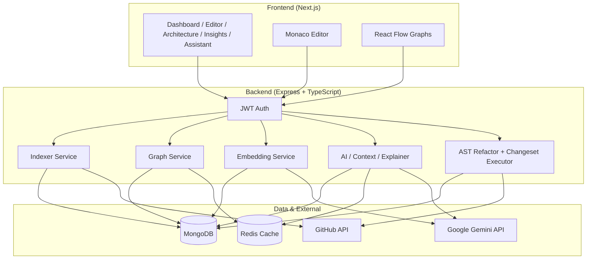

# Cortex — AI Software Engineering Platform

An AI-powered code intelligence platform that indexes JavaScript/TypeScript repositories, builds knowledge graphs, and provides repository-aware AI assistance for architecture exploration, impact analysis, and safe refactoring.

---

## Project Introduction

**Cortex** is a full-stack AI code editor and software engineering platform. It connects a Monaco-based web editor, a Nest-style Express backend, and MongoDB-backed indexing to help developers **understand**, **query**, and **refactor** real codebases—not just single files.

The platform supports:

- **Local workspaces** (filesystem path on the machine running the backend)
- **GitHub workspaces** (read/write via GitHub API — suited for Render + Vercel deployments)

Users sign in, create a workspace, index the repository, then use graphs, insights, AI chat, refactor plans, and decision memory in a unified UI.

---

## Problem Statement

Modern codebases are large, loosely documented, and heavily interconnected. Developers routinely face:

| Pain | Why it hurts |
|------|----------------|
| **No structural map** | Hard to see imports, call chains, and runtime flow across 50–500+ files |
| **Blind refactors** | Renaming or moving code without knowing dependents causes breakage |
| **Generic AI chat** | LLMs without repo context hallucinate or miss project-specific patterns |
| **Cloud deployment gaps** | Local-path-only tools fail on Render/Vercel where there is no full repo checkout |
| **Lost decisions** | Architecture choices live in Slack/Notion, not tied to the codebase |

Traditional IDEs show files; they rarely expose **dependency graphs**, **call impact**, **health scores**, and **RAG-grounded Q&A** in one place.

---

## Solution

Cortex indexes a workspace once (or on save/reindex), then:

1. **Parses** JS/TS with Babel — chunks, imports, calls, exports
2. **Builds graphs** — file dependencies, call graph, project flow heuristics
3. **Embeds** high-value chunks (functions, components, methods) for semantic search
4. **Serves AI** with architecture summary, decisions, risks, and retrieved chunks as context
5. **Executes refactors** via AST transforms with snapshots and rollback

The frontend exposes this through **Editor**, **Architecture**, **Insights**, **Assistant**, and **Decision Memory** views—all backed by authenticated REST APIs.

---

## Features

### Repository understanding
- Workspace indexing (local or GitHub)
- JS/TS parsing: functions, classes, components, methods, interfaces, types
- Path alias resolution (`@/*` from `tsconfig.json` / `jsconfig.json`)
- Incremental embedding cache (content-hash reuse, rate limiting)

### Graphs & architecture
- **Dependency graph** — file-level imports (default) or full structural view
- **Call graph** — function/component call relationships
- **Project flow** — heuristic Browser → Route/Controller → Service → DB → Response
- Draggable React Flow canvas, search, type filters, layout controls

### AI capabilities
- **Repository Q&A** (RAG over embeddings + architecture + decisions)
- **Project explainer** and **file explainer**
- **Refactor plan generation** → changeset executor (rename/move with review)
- **Architecture insights** — health score, risks, AI review
- **Decision memory** — record and inject decisions into AI context

### Editor & refactoring
- Monaco editor, multi-tab, split view
- Save to local disk or GitHub commit
- AST rename/move, diff preview, snapshots & restore
- File deps/dependents panel per open file

### Platform
- JWT authentication on workspace APIs
- Redis caching for graphs and AI responses
- Index stats (files, chunks, embedding coverage)

---

## Architecture Diagram



---

## System Design

### High-level flow

```
Create Workspace → Index Repository → Query Graphs / AI → (Optional) Refactor → Reindex
```

### Core modules (backend)

| Module | Responsibility |
|--------|----------------|
| **Indexer** | Scan files, chunk, resolve imports, persist graph nodes/edges, rebuild file import edges, trigger embeddings |
| **Chunk** | Babel AST extraction: imports, calls, exports, bindings |
| **Graph** | Dependency visualization, project flow, call edge building |
| **Callgraph** | Call graph API, upstream/downstream impact |
| **Architecture** | Orphans, coupling, circular deps, file impact |
| **Embedding** | Gemini embeddings, Mongo cache, top-K search |
| **Context / AI** | Build RAG context, repository Q&A |
| **Explainer** | File/project AI explanations |
| **Intelligence** | Health, risk, repository report, AI review |
| **Decision** | CRUD decision memory per workspace |
| **AST Refactor** | Rename/move functions (local + GitHub via WorkspaceContentService) |
| **Changeset Executor** | Review → snapshot → execute plan → reindex → rollback on failure |
| **Snapshot** | Point-in-time file content for restore |

### Frontend structure

- **Next.js App Router** — `/`, `/workspace/[id]`, `/architecture`, `/insights`, `/assistant`, `/decisions`
- **Zustand** — editor and architecture state
- **Axios** — authenticated API client

---

## Tech Stack

| Layer | Technologies |
|-------|----------------|
| **Frontend** | Next.js 16, React 19, TypeScript, Tailwind CSS, Monaco Editor, React Flow, Dagre, Zustand, Lucide |
| **Backend** | Node.js, Express, TypeScript, Mongoose |
| **Parsing** | Babel (parser, traverse, generator) |
| **AI** | Google Gemini (chat + embeddings) |
| **Database** | MongoDB |
| **Cache** | Redis (optional; in-memory fallback) |
| **Auth** | JWT |
| **Integrations** | GitHub REST API (repo tree, file read/write) |
| **Deploy targets** | Vercel (frontend), Render (backend) |

---

## Installation

### Prerequisites

- **Node.js** 18+ (20+ recommended)
- **MongoDB** (local or Atlas)
- **Redis** (optional but recommended for graph/AI cache)
- **Google Gemini API key**
- **GitHub personal access token** (for GitHub workspaces)

### Clone and install

```bash
git clone <your-repo-url>
cd <project-directory>

# Backend
cd backend
npm install

# Frontend
cd ../frontend
npm install
```

---

## Environment Variables

### Backend (`backend/.env`)

| Variable | Description | Example |
|----------|-------------|---------|
| `PORT` | HTTP port | `5000` |
| `MONGODB_URI` | MongoDB connection string | `mongodb://localhost:27017/cortex` |
| `JWT_SECRET` | Secret for signing JWTs | `your-long-random-secret` |
| `GEMINI_API_KEY` | Google Gemini API key | `AIza...` |
| `REDIS_URL` | Redis URL (optional) | `redis://localhost:6379` |
| `CORS_ORIGIN` | Allowed frontend origins (comma-separated) | `http://localhost:3000` |
| `SKIP_EMBEDDINGS` | Skip embedding generation | `false` |
| `EMBEDDING_MAX_CHUNKS` | Max chunks to embed per workspace | `500` |
| `EMBEDDING_CONCURRENCY` | Parallel embedding requests | `2` |
| `EMBEDDING_DELAY_MS` | Delay between embedding batches | `350` |

### Frontend (`frontend/.env.local`)

| Variable | Description | Example |
|----------|-------------|---------|
| `NEXT_PUBLIC_API_URL` | Backend base URL | `http://localhost:5000/api` |

---

## Running Locally

### 1. Start MongoDB (and Redis if used)

```bash
# Example with Docker
docker run -d -p 27017:27017 mongo:7
docker run -d -p 6379:6379 redis:7
```

### 2. Start backend

```bash
cd backend
cp .env.example .env   # if present; otherwise create .env manually
npm run dev
```

Backend typically runs at `http://localhost:5000`.

### 3. Start frontend

```bash
cd frontend
cp .env.example .env.local   # if present
npm run dev
```

Open `http://localhost:3000`.

### 4. First use

1. Register / log in  
2. Create a workspace (local path or GitHub repo)  
3. Click **Reindex** in the workspace sidebar  
4. Open **Architecture**, **Insights**, or **Assistant**

---

## How Indexing Works

Indexing is triggered on workspace creation/reindex and in the background after file save.

```
1. Load file list
   ├── Local: filesystem walk
   └── GitHub: GitHub API tree + content fetch

2. Persist files in MongoDB (path, content, hash, language)

3. Load tsconfig/jsconfig path aliases (@/* → src/*)

4. For each file (concurrent, batched):
   ├── Parse with Babel → chunks (FUNCTION, COMPONENT, CLASS, METHOD, …)
   ├── Resolve relative + alias imports → resolvedImports
   ├── buildGraph() → FILE nodes, CONTAINS, FILE_IMPORTS_FILE, IMPORTS, CALLS (same-file)
   └── Save chunks + graph nodes/edges

5. buildCallEdges() — cross-file call resolution via importBindings

6. rebuildFileImportEdges() — reconcile all file-level import edges

7. generateWorkspaceEmbeddings() — embed top chunks (cached by content hash)

8. Invalidate Redis graph/AI cache for workspace
```

**Limits (defaults):** max ~2000 files, ~512 KB per file, ~500 embedded chunks per workspace.

---

## Knowledge Graph Pipeline

### Node types

- `FILE`, `FUNCTION`, `COMPONENT`, `CLASS`, `METHOD`, `EXTERNAL_MODULE`

### Edge types

| Relation | Meaning |
|----------|---------|
| `CONTAINS` | File → chunk |
| `FILE_IMPORTS_FILE` | File → file (resolved import) |
| `IMPORTS` | File → npm package |
| `CALLS` | Chunk → chunk |
| `FLOW` | Project flow (heuristic execution layer) |

### Graph APIs (conceptual)

- **Dependency view** — `GET /graph/visual/:workspaceId?mode=files|full`
- **Project flow** — `GET /graph/project-flow/:workspaceId`
- **Call graph** — `GET /callgraph/:workspaceId`
- **File deps/dependents** — `GET /graph/dependencies`, `GET /graph/dependents`
- **Impact** — `POST /callgraph/impact`, `POST /callgraph/downstream`, `POST /architecture/impact`

---

## AI Pipeline

```
User question / explain / refactor goal
        │
        ▼
ContextService.buildQuestionContext()
        ├── EmbeddingService.search() → top semantic chunks
        ├── ArchitectureService.getArchitectureSummary()
        └── DecisionService.getWorkspaceDecisions()
        │
        ▼
Prompt assembly (architecture + decisions + chunks)
        │
        ▼
Gemini generate → answer + optional sources
        │
        ▼
(Optional) Redis cache for repeated queries
```

**Refactor path:** goal → `refactor-plan/generate` → changeset → `changeset-executor/execute` (review, snapshot, AST apply, reindex).

---

## Redis Usage

When `REDIS_URL` is set:

| Key pattern | Purpose | TTL (approx.) |
|-------------|---------|----------------|
| `graph:dependency-files:{workspaceId}` | File-level dependency graph | 15 min |
| `graph:dependency:{workspaceId}` | Full dependency graph | 15 min |
| `graph:callgraph:{workspaceId}` | Call graph | 15 min |
| `graph:projectflow:{workspaceId}` | Project flow | 15 min |
| `ai:repository:{workspaceId}:{hash}` | Cached Q&A | varies |
| `embedding:{contentHash}` | Global embedding cache | persistent |

**Invalidation:** workspace reindex, file save, and explicit cache bust via `invalidateWorkspaceCache(workspaceId)`.

Without Redis, the app falls back to in-memory/no-op cache behavior where implemented.

---

## API Documentation

Base URL: `{API_URL}` (e.g. `http://localhost:5000/api`)

Most routes require `Authorization: Bearer <token>`.

### Auth

| Method | Path | Description |
|--------|------|-------------|
| POST | `/auth/register` | Register user |
| POST | `/auth/login` | Login, returns JWT |

### Workspaces

| Method | Path | Description |
|--------|------|-------------|
| GET/POST | `/workspaces` | List / create workspaces |
| GET | `/workspaces/:id` | Get workspace |

### Files & editor

| Method | Path | Description |
|--------|------|-------------|
| GET | `/file/workspaces/:workspaceId` | List indexed files |
| GET | `/file/content?workspaceId=&filePath=` | Read file content |
| POST | `/file/save` | Save file (local or GitHub) |

### Indexer

| Method | Path | Description |
|--------|------|-------------|
| POST | `/indexer/:workspaceId` | Start background reindex |
| GET | `/indexer/stats/:workspaceId` | Index / embedding stats |

### Graph & architecture

| Method | Path | Description |
|--------|------|-------------|
| GET | `/graph/visual/:workspaceId` | Dependency graph |
| GET | `/graph/project-flow/:workspaceId` | Project flow |
| GET | `/graph/dependencies` | File imports |
| GET | `/graph/dependents` | Files importing this file |
| GET | `/architecture/summary/:workspaceId` | Architecture summary |
| POST | `/architecture/impact` | File import impact |

### Call graph

| Method | Path | Description |
|--------|------|-------------|
| GET | `/callgraph/:workspaceId` | Call graph |
| POST | `/callgraph/impact` | Upstream caller impact |
| POST | `/callgraph/downstream` | Downstream call impact |

### AI & context

| Method | Path | Description |
|--------|------|-------------|
| POST | `/ai/repository-question` | RAG repository Q&A |
| POST | `/explainer/file-ai` | Explain file |
| POST | `/explainer/project-ai` | Explain project |
| POST | `/refactor-plan/generate` | AI refactor plan |
| POST | `/changeset-executor/execute` | Execute refactor plan |

### Intelligence & decisions

| Method | Path | Description |
|--------|------|-------------|
| GET | `/intelligence/health/:workspaceId` | Health score |
| GET | `/intelligence/risk/:workspaceId` | Risk analysis |
| GET | `/intelligence/report/:workspaceId` | Full report |
| GET | `/intelligence/review/:workspaceId` | AI architecture review |
| GET/POST | `/decision/:workspaceId` | List / create decisions |

### Refactor & snapshots

| Method | Path | Description |
|--------|------|-------------|
| POST | `/ast-refactor/rename` | Rename function |
| POST | `/ast-refactor/move` | Move function |
| POST | `/snapshot` | Create snapshot |
| POST | `/snapshot/restore/:id` | Restore snapshot |

### GitHub

| Method | Path | Description |
|--------|------|-------------|
| GET | `/github/repos` | List user repos (token) |

---

## Folder Structure

```
.
├── backend/
│   ├── src/
│   │   ├── app.ts                 # Express app entry
│   │   ├── routes.ts              # Route mounting + auth
│   │   ├── config/                # env, db
│   │   ├── middlewares/           # JWT auth
│   │   ├── modules/
│   │   │   ├── indexer/           # Workspace indexing
│   │   │   ├── chunk/             # AST chunking
│   │   │   ├── graph/             # Graph build & visual API
│   │   │   ├── callgraph/         # Call graph & impact
│   │   │   ├── architecture/      # Summary, orphans, impact
│   │   │   ├── embedding/         # Gemini embeddings + search
│   │   │   ├── context/           # RAG context builder
│   │   │   ├── ai/                # Repository Q&A
│   │   │   ├── explainer/         # File/project explain
│   │   │   ├── intelligence/      # Health, risk, AI review
│   │   │   ├── decision/          # Decision memory
│   │   │   ├── ast-refactor/      # Babel refactors
│   │   │   ├── changeset-executor/
│   │   │   ├── snapshot/
│   │   │   ├── file/              # File CRUD API
│   │   │   ├── workspace/         # Workspace model
│   │   │   └── auth/
│   │   └── shared/
│   │       ├── github/            # GitHub API client
│   │       ├── workspace-content/ # Unified read/write
│   │       ├── redis/             # Cache helpers
│   │       └── utils/             # path, chunk-node, path-alias
│   └── package.json
│
├── frontend/
│   ├── src/
│   │   ├── app/                   # Next.js pages
│   │   ├── components/
│   │   │   ├── editor/            # Monaco, shell, deps panel
│   │   │   ├── architecture/      # Graph canvas, controls
│   │   │   ├── insights/          # Health dashboard
│   │   │   ├── assistant/         # Project AI chat
│   │   │   └── platform/          # Sidebar, dashboard
│   │   ├── services/              # API clients
│   │   └── store/                 # Zustand stores
│   └── package.json
│
└── README.md
```

---

## Future Roadmap

- [ ] **Multi-language support** — Python, Go, Java parsers
- [ ] **True runtime tracing** — replace heuristic project flow with instrumented traces
- [ ] **PR integration** — GitHub PR comments, CI indexing
- [ ] **Team decision memory** — shared decisions with conflict resolution UI
- [ ] **Unlimited embeddings tier** — configurable per workspace plan
- [ ] **LSP integration** — diagnostics alongside Monaco
- [ ] **Visual refactor preview** — inline diff in graph view
- [ ] **WebSocket indexing progress** — live reindex status bar
- [ ] **SSO / OAuth** — GitHub login, org workspaces
- [ ] **Export reports** — PDF/Markdown architecture docs

---

## Screenshots

> Add screenshots to `docs/screenshots/` and reference them here after capture.

| View | Description |
|------|-------------|
| Dashboard | Workspace list, local vs GitHub creation |
| Editor | Monaco + file tree + AI tools panel |
| Architecture | File dependency graph (React Flow) |
| Insights | Health score, risks, AI review |
| Assistant | Project-wide RAG chat |
| Decisions | Decision memory board |

**Placeholder paths (replace with your assets):**

```markdown


```

---

## Demo GIF

> Record a short demo (create workspace → reindex → ask AI → view graph) and save as `docs/demo.gif`.

```markdown

```

**Suggested flow for recording:**

1. Create GitHub workspace  
2. Reindex → show embedding stats in header  
3. Open Architecture → drag nodes  
4. Ask Assistant a architecture question  
5. Generate refactor plan on a file  

---

## Contributing

Contributions are welcome.

1. Fork the repository  
2. Create a feature branch: `git checkout -b feature/my-feature`  
3. Make changes; keep backend `npm run build` and frontend `npm run build` passing  
4. Commit with clear messages  
5. Open a Pull Request describing **what** and **why**

**Guidelines:**

- Match existing TypeScript and module conventions  
- Prefer focused PRs over large mixed changes  
- Do not commit `.env` files or API keys  
- Test reindex + graph view after graph/indexer changes  

---

## License

This project is provided as-is for educational and development use.

If you intend to open-source formally, add a specific license file (e.g. `LICENSE` with MIT or Apache-2.0) and update this section with the chosen license name and link.

---

<p align="center">
  <strong>Cortex</strong> — Neural intelligence for your codebase
</p>
